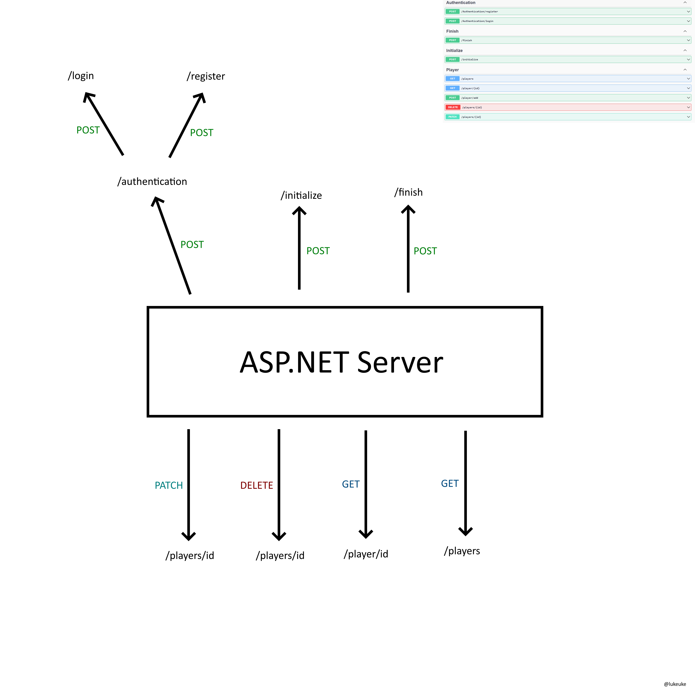

# GuessWord Server
GuessWord Server is a API made in ASP.NET, which provides: 
- User login/registration with JWT authentication,
- ORM MSSQL Database,
- Entity Framework

>  This API takes word from other api, and user has to guess the word, its simmilar to game called "Wordle"

## Endpoints

## Authors
- [@Lukeuke](https://www.github.com/Lukeuke)
